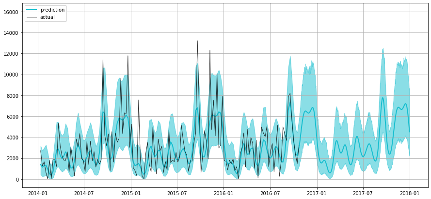
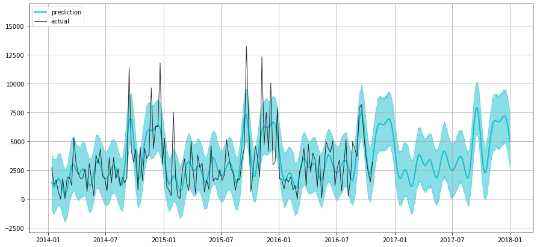
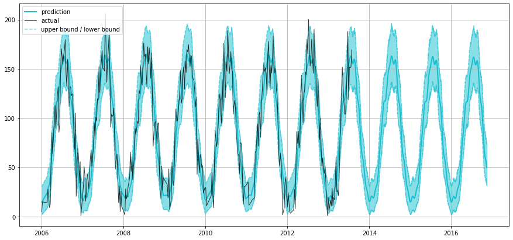

# Sales Time Series Forecasting Module

This repository contains the source code of the sales time series forecasting module written for the SKLAD project. The presented version is a prototype of the code used at the production level. 

#### Brief description of the project
SKLAD is a SaaS ERP and warehouse management system for small and medium businesses in retail sector. The MVP is a data warehouse with a web as well as mobile client. A mobile phone replaces traditional barcode scanner and is used to check the goods in and out.

The Business Intelligence section derives insights from transactional, financial as well as inventory data, which is generated internally by managing everyday business operations with help of the app. It includes both descriptive and predictive modules devoted to facilitating business owner in decision making process. 

This repository presents the source code of the prototype for sales prediction module. 

#### Setup
The transactions data, generated by daily operations, is accumulated and stored in the data warehouse. The applied schema allows querying transactions by multiple categories of goods. Data warehouse is regularly queried (batch processing) and the sales time series for each category of goods is being transfered through pipelines to the sales forecasting module. The sales forecasting module takes standardised transaction time series as an input and generates forecast for future *n* periods.

The input data contains 2 columns, the actual aggregated daily *sales* data in monetary equivalent and a timestamp *datetime* column, which serves as an index.  

#### Approach and model selection
The traditional approach for time series analysis is to start off with (S)ARIMA models. However, despite their generally good performance, (S)ARIMA models appear to be somewhat impractical for the problem of our kind, since they require quite a lot of manual assistance. This includes checking for stationarity with Dickey-Fuller test, finding optimal *p* and *q* seasonal parameter values etc. Thus, alternative options, such as as regularized linear models (Ridge Regression, LASSO), neural networks (LSTM) and, of course, XGBoost were considered. Their performance was compared based on the MSE and MAPE (mean absolute percentage error) metrics.

As it can be expected, XGBoost has outperformed all of its competitors in terms of capturing seasonal components, but has failed by large extent when trend was present in the data. Working with first order differences was an option in terms of predictive accuracy, but it has introduced issues with converting the series back. Thus, Long Short-Term Memory NN seemed like a suitable solution in terms of performance. The problem was, that all of the options above require feature engineering to generate lags and dummy variables for weekends and holidays. Trying to automate the selection of starting and ending lags based on ACF and PACF values has appeared to be less trivial than it sounds. 

The main reason why FB Prophet, an open source time series library published by Facebook in 2017, was chosen in our case, is that it allows to avoid all the problems mentioned above. [According to the authors](https://facebook.github.io/prophet/), the fbprophet is an additive model capable of capturing various seasonal components (yearly, daily etc.) and linear/non-linear trends in time series. However, the key benefit of the Prophet is that it requires little to no model parameter tuning to make acceptable forecasts at the production level. The model at heart of fb Prophet can be generally represented as:
```
   y(t) = g(t) + s(t) + h(t) + e
```
where:
- *g(t)* is a trend component
- *s(t)* seasonality component, represents periodic changes in data
- *h(t)* - holidays

Detailed description of the Prophet model is provided in the [paper](https://peerj.com/preprints/3190/).

## The Module
After the brief introduction, lets dive into the detail. 

##### What the module does:
1. Preprocessing: remove shift in distribution if present.
2. Prediction: train the Prophet model
3. Assessment: get the values for performance indicatiors 
4. Plot results [optional]

#### 1. Data Pre-Processing

As previously mentioned, Prophet does not require a lot of data manipulation and can deal with non-stationary time series. Thus, time series detrending step (differenciation) can be ommited. Among the other three common time series data transformations, namely standardization (mean zero and st.dev.equals to one), normalization (rescaling data to 0-1 scale) and power transform only the letter is known to significantly contribute to Prophets performance. 

Power Transform removes a shift in data distribution in order to make the data follow Gaussian distribution. In our model, the decision whether the data needs transformation is done automatically based on the improved Kolomogorov-Smornov test ([Lilliefors Test]( https://www.statisticshowto.datasciencecentral.com/lilliefors-test/)) for normality of distribution. 

```python

from statsmodels.stats.diagnostic import lilliefors

class TS:
   ...
   def preprocess(self, test_size=0.3):
   ...
      # Lilliefors Test
      self.lilliefors_D, p = lilliefors(self.df.y)
```

The obtained test statistic is compared to the K-S Test ctitical value at 5% significance level. If the null hypothersis is rejected, it means that the data follows a non-normal distribution and the [Box-Cox](https://www.statisticshowto.datasciencecentral.com/box-cox-transformation/) power transformation is applied. 

```python
   ...
      #Kolmogorov-Smirnov Goodness of Fit Test statistic at 5% significance level
      self.KS_stat_05 = 1.36 / len(self.df)**0.5            

      if self.lilliefors_D > self.KS_stat_05:
          print("[ The H0 normality hypothesis at alpha = 0.05 is rejected ]")
          print("[ Lilliefors test statistic: {:.5f}, Kolmogorov-Smirnov ".format(self.lilliefors_D) +
                "critical value: {:.5f} ]".format(self.KS_stat_05))
          self.normalize = True
```
The Box-Cox transformation is probably the most popular and staightforward way to normalize the data distribution. It is based on the exponent *lambda* and can be represented with pseudocode as:
```
   if lambda != 0 :
      y = (y^lambda - 1) / lambda
   else:
      y = log(y)
```
Note that this transformation applies only for positive values, but since we have sales data, this condition is logically expectd to be satisfied.

The corresponding Python code looks as follows:

```python
...
from scipy import stats
...
   
  ... 
  def preprocess(self, test_size=0.3):
     ...
     # Box-Cox transformation      
     if self.normalize:

         self.df = self.df[self.df.y > 0]

         x, self.optimal_lambda = stats.boxcox(self.df.y[:-self.index])
         print("[ Applying Box-Cox Transformation." +
               " Optimal lambda: {:.5f} ]".format(self.optimal_lambda))
         self.df.y = stats.boxcox(self.df.y, self.optimal_lambda)
```
Here, *optimal lambda* is the value of lambda that helps the data to best approximate normal distribution upon transformation.

It should be mentioned, that before data transformation the preprocessing step includes data cleaning, i.e. NAs are removed, and aggregation by daily ot weekly sales. Weekly aggregation is apploed if more than a year of historical data is available, since it helps to remove outliers i.e. reduce noise in the data. 

```python
...
    def preprocess(self, test_size=0.3):

        # cleaning the data
        df = self.raw_df.dropna().drop_duplicates()

        if len(df) > 365:
            self.step = "W"
        else:
            self.step = "D"

        # aggregating data 
        df = df.resample(self.step).apply(sum)

        # setting column names required by Prophet
        self.df = df.reset_index()
        self.df.columns = ["ds", "y"]
```
#### 2. Prediction
Today all machine learning in python is basically done in two lines of code thanks to the open source packages like scikit-learn or tensorflow. FB Prophet is no exception, however couple of specifics have to be taken into account during setup. 

Prophet requires specification of the forecast size in days, thus if *weekly* factor is chosen, we increase the index accordingly by multiplying by 7:
```python
   ...
      # default size of test set is 30% of data
      self.index = int(len(self.df)*test_size)
      ...
      
   def predict(self):
      if self.step == "W":                              # W for weekly
         self.index_prophet = self.index*7
     else:
         self.index_prophet = self.index

     train = self.df[:-self.index]
```
The "machine learning part" is then:
```python
     self.model = Prophet()
     self.model.fit(train)
     
     future = self.model.make_future_dataframe(periods=self.index_prophet)
        
     self.forecast = self.model.predict(future)
```
Here *future* is just a list of dates for which the prediction is to be made.

In case if we have applied the Box-Cox transformation, the *inv_boxcox* from the *scipy.special* library needs to be applied.
```python
     if self.normalize:
         for x in ["trend","yhat", 'yhat_lower', 'yhat_upper']:
             self.forecast[x] = inv_boxcox(self.forecast[x], self.optimal_lambda)
         self.df.y = inv_boxcox(self.df.y, self.optimal_lambda)  
```
#### 3. Assessment
How good is our prediction?

The tricky part here is that since our end user is not expected to have a deep domain knowledge in data science field, a simple [MAPE](https://en.wikipedia.org/wiki/Mean_absolute_percentage_error) metric is applied. This is done primarily because it's interpretation is rather intuitive.

MAPE is calculated by the formula:
```
MAPE = sum( (true - forecast) / true ) * 100 / n
```
It tells us how much theprediction deviates from the actual value in percents on average

The code looks as follows:
```python
class TS:
   
    ...
    
    def assess(self):
        
        # combining prediction with test values
        forecast = self.forecast.set_index("ds")
        forecast = forecast[["yhat", 'yhat_lower', 'yhat_upper']]
        test = self.df.set_index("ds")
        
        self.combined_df = forecast.join(test)
                
        df = self.combined_df.copy()
        
        df['e'] = df['y'] - df['yhat']
        df['p'] = 100 * df['e'] / df['y']
        
        predicted = df[-self.index:]
        
        self.MAPE = np.mean(np.abs(predicted["p"]))
```
#### 4. Visualization
The presented module is build to provide a forecast of future sales that can be viewed by the business owner in a dashboard, thus visualizing our prediction is the key. 

Since this is a prototype, a simple solution using *matplotlib* is used to give you an idea of what the graph actually looks like in the dashboard itself. It visualizes the prediction with the 95% confidence intervals for the upcoming perios.

```python
    def plot(self):
    
        plt.figure(figsize=(15, 7))
        plt.plot(self.combined_df["yhat"], "C9", label="prediction", linewidth=2.0)
        plt.plot(self.combined_df["y"], "black",label="actual", linewidth=1.0, alpha=0.8)
        plt.fill_between(self.combined_df.index,self.combined_df["yhat_lower"], 
                         self.combined_df["yhat_upper"],color="C9", alpha=0.5)
        
        plt.legend(loc="best")
        plt.grid(True)
        plt.show()
```

To give you an example, the graphs obtained for two test datasets are presented below.

The first graph illustates a forecast for office supplies sales time series. Here the Box-Cox transformation was applied. As we can see, actual values remain within the predicted confidence interval along the whole graph except for a couple of shocks, which are clearly outliers. 



The graph below shows how our prediction looks like if we do not apply Box-Cox transformation.
Not that it disallows negative values for predictions, which supports business logic behind sales data.



Even though the difference is no that significant in terms of MAPE (22.1 against 22.8), visually the model is able to better capture the fluctuations in the data when transformation is applied. The dataset is available [here](data/)

Another example is actually built on the wather timeseries. Unlike the previos dataset, where a alightly pronounced uprising trend is present, this example serves the purpose of showing how the model deals with "better" timeseries (stationarity and absence of outliers). Here, the MAPE value is above 91%. 



## Endnote

Clearly, there is still a room for improvement. Further automated data preprocessing and optimal model parameter search are the prioritised directions for improvement so far. However, the ability of the presented model to produce pretty accurate forecasts (with 75-85% MAPE on average) without any model parameter tuning can already be considered as a good result.

The main purpose of this model is to give business owner an idea about the expected sales dynamics in the upcoming periods. 
What will the demand be like for this category of good in different times of the year? Is it overall growing or decreasing? The model is already able to precisely answer those questions, which allows business owners to adjust their inventory accordingly. 

#### References
- https://facebook.github.io/prophet/
- https://mlcourse.ai/articles/topic9-part2-prophet/
- https://towardsdatascience.com/an-end-to-end-project-on-time-series-analysis-and-forecasting-with-python-4835e6bf050b
